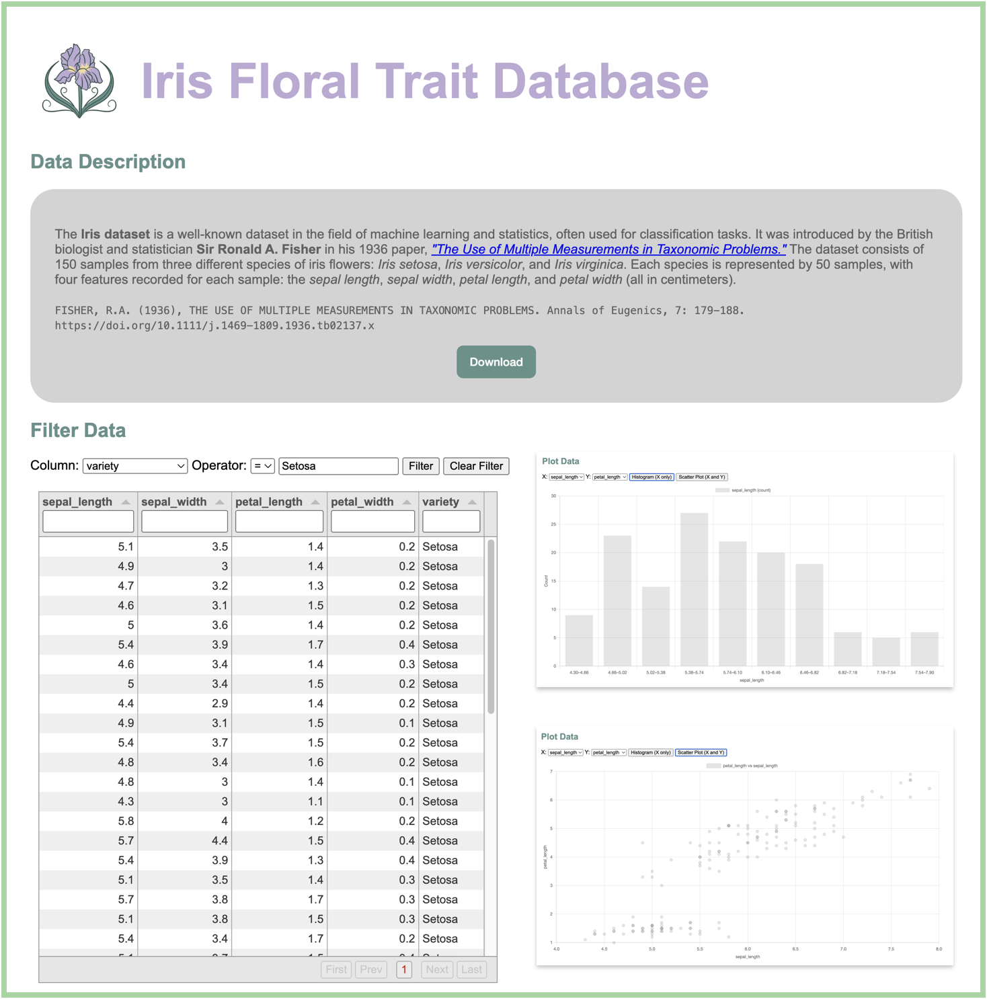

# Generic Data Heads-Up Display

A static, fork-it-yourself GitHub Pages template that turns a CSV into a browsable data explorer: sortable/filterable table, scatter and histogram plots, and an export of whatever subset the visitor has curated. No server, no build step — everything runs in the browser.

[Live example using the Iris dataset](https://chasenunez.github.io/data_HUD/)



## Quick start

1. **Fork** this repo.
2. **Drop your CSV** into `data/` (or point at a public URL).
3. Edit `dataURL` near the top of `app.js`.
4. Commit, push, enable GitHub Pages (Settings → Pages → `main` branch). Your site lives at `https://<your-username>.github.io/<repo>/`.

```javascript
// app.js — line ~9
const dataURL = "data/iris.csv";   // or "https://yourbucket.s3.amazonaws.com/yourfile.csv"
```

## Files

```
index.html        # UI skeleton
style.css         # styles and theme variables (colors near the top)
app.js            # CSV loading, table, plots, download
data/iris.csv     # example dataset — replace with yours
```

## CSV expectations

- First row is the header.
- Comma-separated.
- Missing values: `NA`, `NaN`, `-999`, or empty cells. Numeric conversions skip non-numeric entries; the table just shows them blank.
- Numeric columns must be parseable by `parseFloat` (no thousands separators).
- For date columns, store as ISO `YYYY-MM-DD`.

## How visitors use it

- **Sort:** click a column header.
- **Filter:** column + operator + value above the table (e.g. `year > 2019`).
- **Plot:** pick X and Y, click *Scatter*; or pick X and click *Histogram*.
- **Export:** *Download CSV* exports the current view (filtered + sorted).

## Exporting with provenance

The download button prepends a few `#`-comment lines (export date, source, citation, license, notes) before the CSV body. That's a low-effort way to keep provenance attached to whatever a visitor downloads.

The implementation lives in `downloadCSVWithMetadata()` in `app.js`. Customise the metadata fields by editing the call site near the bottom of `app.js`. CSV doesn't have an official metadata standard, so this is a convention — Excel may treat the `#` lines as data rows. If you need strict machine-readable metadata, ship a companion `metadata.json` instead.

## Customisation cheat-sheet

| What | Where |
|---|---|
| Logo, page title | `index.html` (``, `<h1 id="site-title">`) |
| Colours, fonts | `style.css` (variables near the top) |
| CSV path | `app.js`, `dataURL` |
| Pagination size, histogram bins, table behaviour | `app.js` |

## FAQ

**Blank table.** Check `dataURL`. If using an external URL and the browser console shows a CORS error, the host needs `Access-Control-Allow-Origin: *`.

**"No numeric data" when plotting.** Check the column actually contains numbers parseable by JS. `NA` / `-999` are skipped during plotting but stay visible in the table.

**Want a ZIP with CSV + metadata.json instead of inline `#` lines.** That needs JSZip. Easy to add if you'd rather have strict separation.

## License

See `LICENSE.md`.
